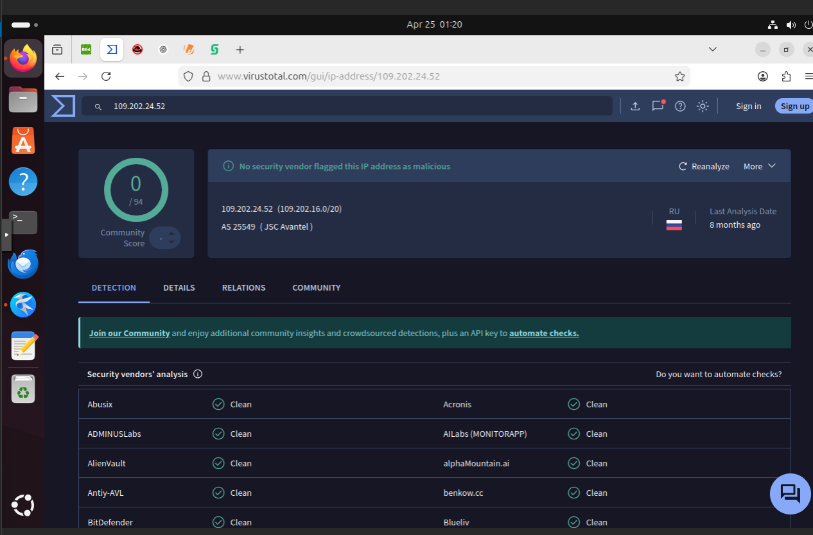
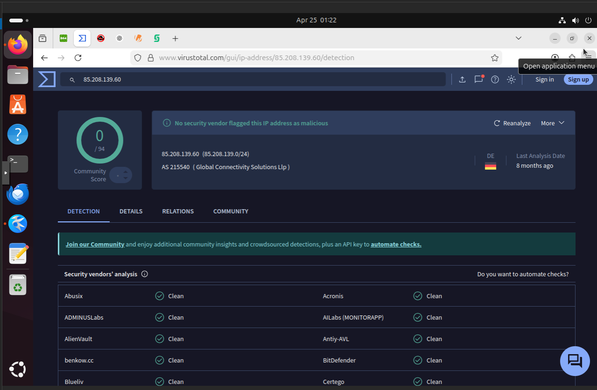
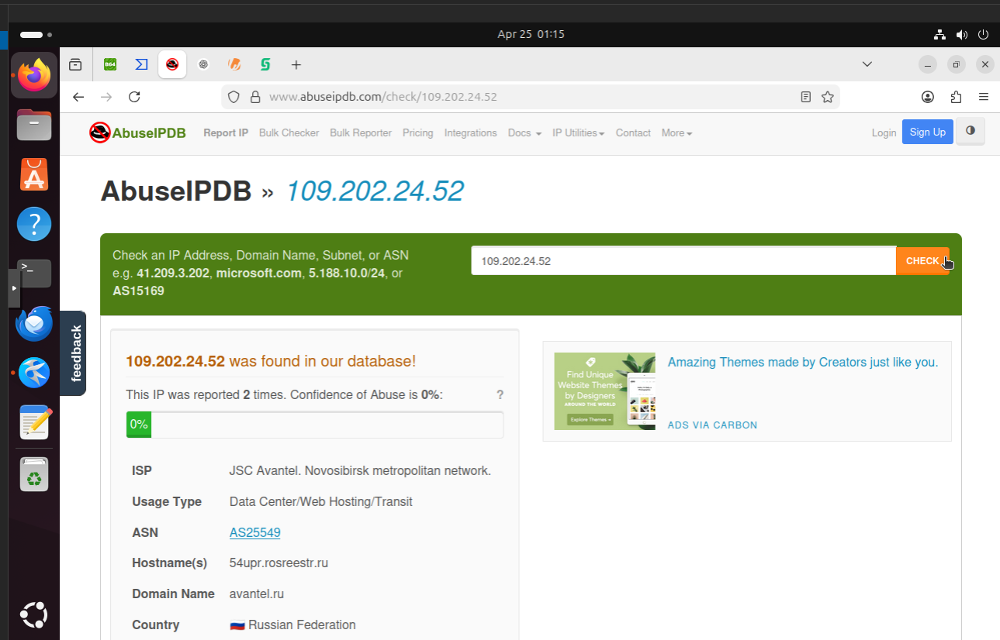
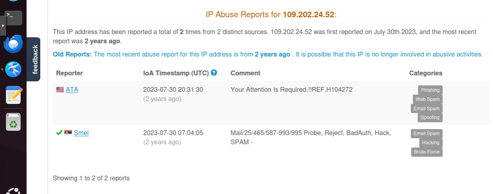
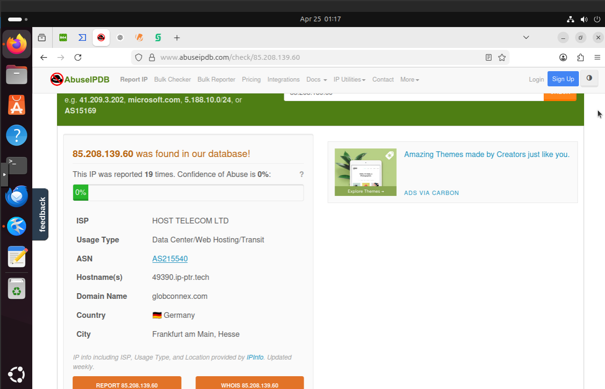
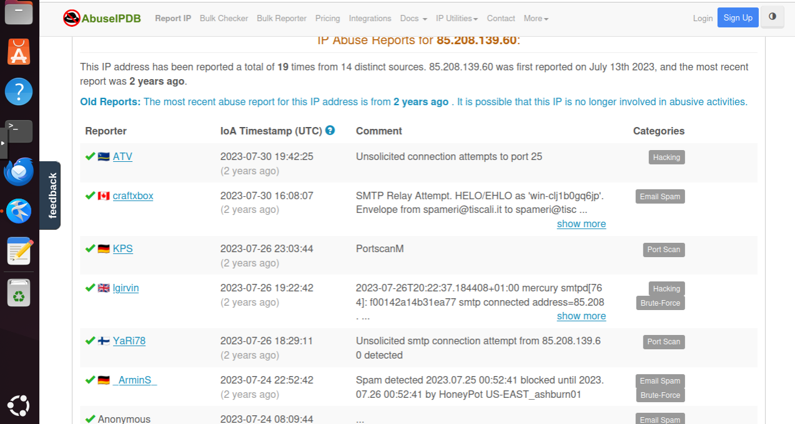
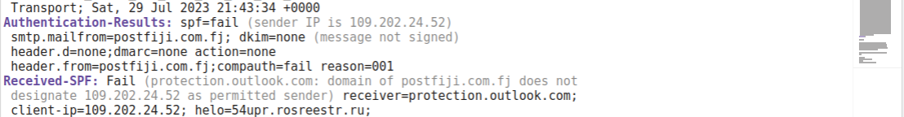

# Email Header Analysis — Breaking Down a Scam Email

## Introduction

This project is a simple walkthrough of how I analyzed a suspicious email and proved that it is a scam.

Instead of throwing technical terms everywhere, the goal here is to show how you can look at an email step by step and figure out what is really going on behind the scenes.

The email in question claims that someone is delivering 10.5 million USD and urgently needs your contact details. That alone already sounds suspicious, but I didn’t stop there. I went deeper into the email headers to verify it.

---

## First Impression

The message tries to create urgency and excitement at the same time. It says the sender is a “Diplomatic agent” who has just arrived with a large sum of money and needs your address and phone number immediately.

This is a well-known scam pattern. The attacker is trying to rush you into acting before you think.

---

## Looking at the Sender

The email claims to come from:

From: "Mr.Wood Forest" <nemani.tukunia@postfiji.com.fj>  
Reply-To: mywoodforestbiz.7@gmail.com  

At a glance, it looks like a normal email. But when you slow down, something is off.

The sender is using a domain that looks official (postfiji.com.fj), but replies are being redirected to a Gmail account. That is not something legitimate organizations do.

This is the first clear sign that the identity is being faked.

---

## Tracing Where the Email Actually Came From

Emails don’t just appear in your inbox. They travel through multiple servers, and each step is recorded in what we call "Received" headers.

When I traced the path of this email, I found that it actually originated from these IP addresses:

- 85.208.139.60  
- 109.202.24.52  

It also passed through a server with the domain:

- 54upr.rosreestr.ru  

Now compare that to the claimed sender domain: postfiji.com.fj.

They have nothing in common.

This tells us that the email did not come from where it claims. Someone is pretending.

---

## Authentication Checks

Modern email systems use a few mechanisms to verify if an email is legitimate. The main ones are SPF, DKIM, and DMARC.

Here is what this email shows:

- SPF: fail  
- DKIM: none  
- DMARC: none  

In simple terms, this means:
- The server that sent the email is not allowed to send on behalf of the domain  
- There is no cryptographic signature to verify the message  
- There is no policy protecting the domain  

A legitimate email usually passes at least one of these checks. This one fails all of them.

---

## Message-ID Mismatch

Another interesting detail is the Message-ID:

Message-ID: <...@54upr.rosreestr.ru>

This ID is generated by the server that created the email. In a normal situation, it should match the sender’s domain.

Here, it points to rosreestr.ru instead of postfiji.com.fj.

That is another strong indication that the email was forged.

---

## The Trick Behind the Target

The email is sent to an address that appears to belong to the same domain as the sender.

This is not random. Attackers sometimes do this to make the email look like internal communication, which increases trust.

To someone not paying attention, it may look like a normal internal message.

---

## Breaking Down the Social Engineering

At this point, the technical evidence already shows the email is fake. But the content itself also tells the same story.

The attacker uses:
- Authority (claims to be a diplomatic or IMF agent)
- Urgency (says they are at the airport right now)
- Reward (offers a huge amount of money)
- Pressure (asks for immediate response)

This combination is designed to override logic and trigger quick action.

---

## Final Conclusion

After putting everything together, the picture is very clear.

The sender identity is fake.  
The email was sent from unrelated servers.  
All authentication checks failed.  
The Message-ID does not match the claimed domain.  
The content follows a known scam pattern.  

This is a phishing email, specifically an advance-fee scam.

---

## Why This Matters

Most people focus only on the message they see. But the real truth is always in the headers.

Knowing how to read and question these details gives you a huge advantage. You are no longer relying on trust, you are verifying it.

---

This is a simple example, but the same approach can be used in real investigations and incident response work.
